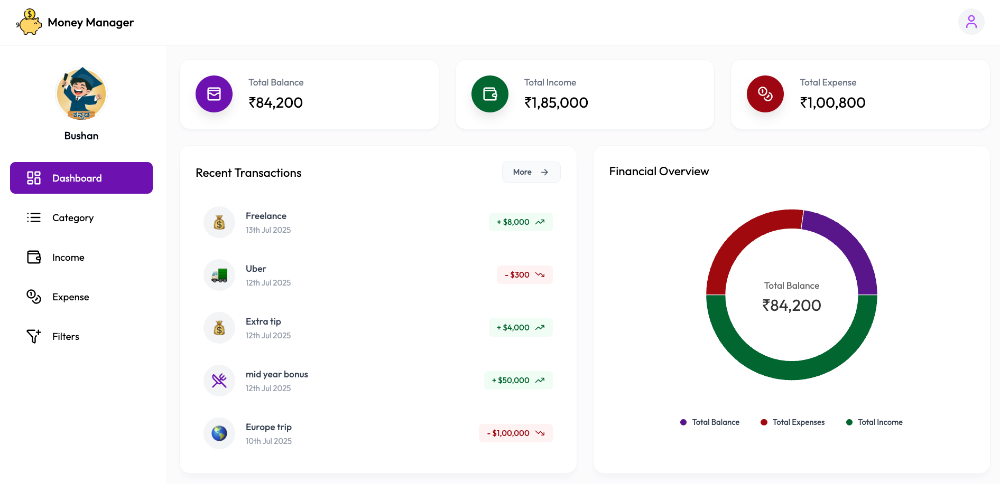
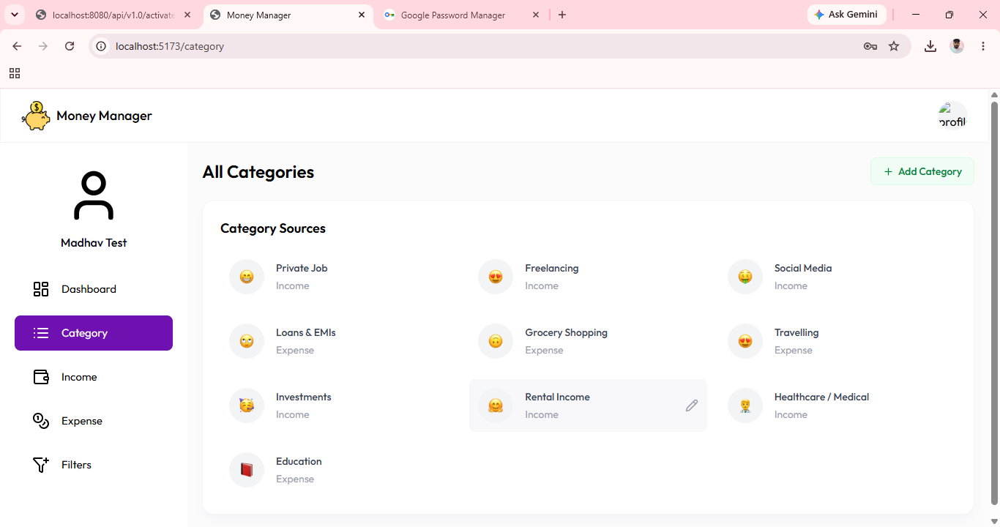
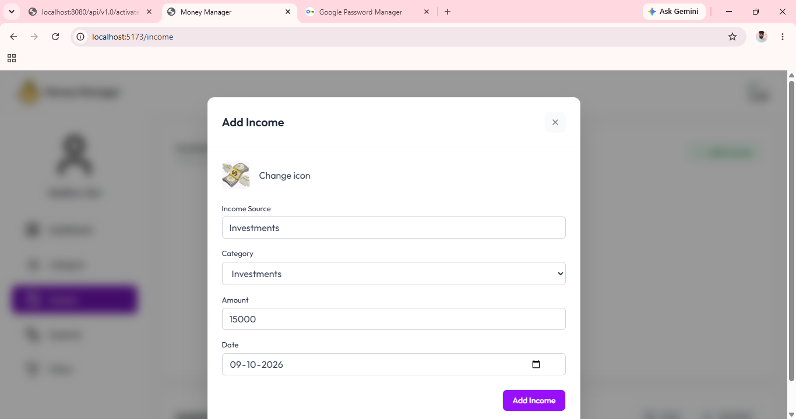
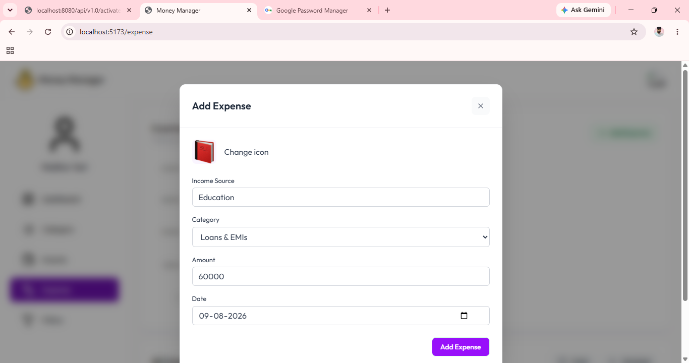
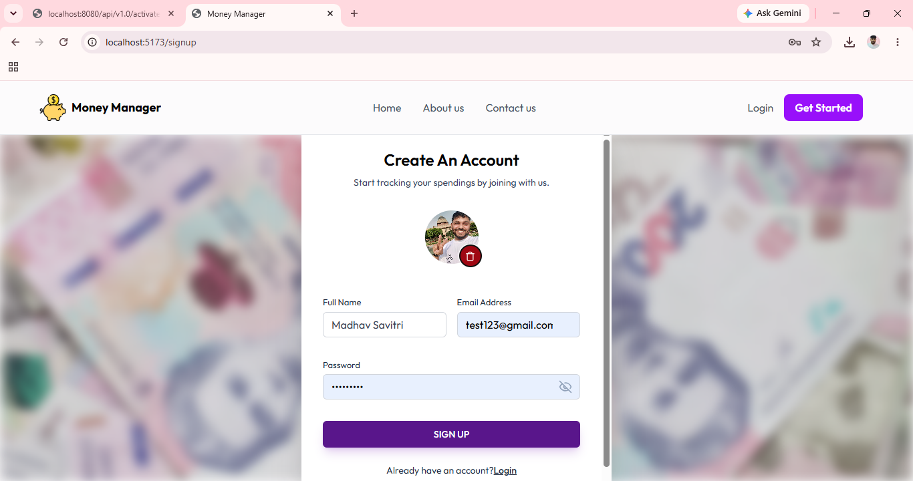
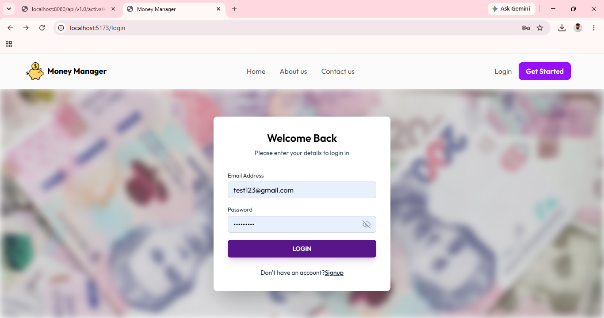

# Money Manager

A personal-finance application for recording income and expenses, organising them into categories, and seeing a clear snapshot of your financial position. The REST API is built with Spring Boot and provides secure, user-specific financial data for the Money Manager web client.

<p align="center">
  
</p>

## Highlights

- **Personal dashboard** — view total balance, total income, total expenses, recent activity, and a visual financial overview.
- **Income and expense tracking** — add and remove dated transactions with a source, amount, category, and custom icon.
- **Custom categories** — create, list, and update income and expense categories.
- **Search and filtering** — filter transactions by date range, type, keyword, and sort order.
- **Secure accounts** — sign up, activate the account by email, and authenticate with JWT-based, stateless security.
- **Export and email reports** — download or email the current month's income and expense reports as Excel workbooks.

## Product tour

### Dashboard

An at-a-glance view of balances and recent activity. Income, expenses, and the resulting balance are presented together so users can quickly understand their current position.


### Categories

Keep transaction sources organised by creating separate income and expense categories. Categories can also be updated as needs change.



### Record income and expenses

Dedicated forms make it simple to enter an income or expense with its source, category, amount, date, and icon.

| Add income | Add expense |
| --- | --- |
|  |  |

### Account access

New users can create an account, then sign in to access their own financial data.

| Sign up | Login |
| --- | --- |
|  |  |

## Technology

| Area | Technology |
| --- | --- |
| Language & framework | Java 21, Spring Boot 3.5 |
| API | Spring Web REST API |
| Persistence | Spring Data JPA, MySQL |
| Authentication | Spring Security, JWT, BCrypt |
| Reporting | Apache POI (Excel `.xlsx`) |
| Notifications | Spring Mail (SMTP) |
| Build | Maven Wrapper |

## API overview

The application is served beneath `/api/v1.0` (for example, `http://localhost:8080/api/v1.0`). Other than the public account and health endpoints, routes require a JWT bearer token.

| Area | Endpoint | Methods |
| --- | --- | --- |
| Health | `/health`, `/status` | `GET` |
| Authentication | `/register`, `/activate`, `/login` | `POST`, `GET`, `POST` |
| Profile | `/profile` | `GET` |
| Dashboard | `/dashboard` | `GET` |
| Categories | `/categories`, `/categories/{type}`, `/categories/{categoryId}` | `GET`, `POST`, `PUT` |
| Incomes | `/incomes`, `/incomes/{id}` | `GET`, `POST`, `DELETE` |
| Expenses | `/expenses`, `/expenses/{id}` | `GET`, `POST`, `DELETE` |
| Transaction filtering | `/filter` | `POST` |
| Excel downloads | `/excel/download/income`, `/excel/download/expense` | `GET` |
| Email reports | `/email/income-excel`, `/email/expense-excel` | `GET` |

## Getting started

### Prerequisites

- Java 21
- MySQL 8+
- A configured SMTP provider if account activation emails and emailed reports are required

### 1. Create the database

```sql
CREATE DATABASE moneymanager;
```

### 2. Configure the application

Configure your database, mail provider, JWT secret, and frontend URL in `src/main/resources/application.properties`. Keep credentials out of version control; environment variables or a local, ignored properties file are recommended.

At minimum, supply values for the following settings:

```properties
spring.datasource.url=jdbc:mysql://localhost:3306/moneymanager
spring.datasource.username=your_mysql_user
spring.datasource.password=your_mysql_password
jwt.secret=your_base64_jwt_secret
money.manager.frontend.url=http://localhost:5173
app.activation.url=http://localhost:8080
```

For production, `application-prod.properties` reads `MYSQL_URL`, `MYSQLUSER`, and `MYSQLPASSWORD` from the environment.

### 3. Run the API

Windows:

```powershell
.\mvnw.cmd spring-boot:run
```

macOS/Linux:

```bash
./mvnw spring-boot:run
```

Verify that the service is running:

```text
GET http://localhost:8080/api/v1.0/health
```

Expected response:

```text
Application is running
```

## Security notes

- Passwords are encoded with BCrypt.
- The API uses stateless JWT authentication and CORS permits the local web client at `http://localhost:5173` by default.
- Never commit real database passwords, SMTP credentials, or JWT secrets. Rotate any credentials that have already been exposed and move them into environment-specific configuration.

## Project structure

```text
src/main/java/in/madhav/moneymanager/
├── config/          # Security and CORS configuration
├── controller/      # REST endpoints
├── dto/             # API request/response models
├── entity/          # JPA entities
├── repository/      # Data access layer
├── security/        # JWT request filter
├── service/         # Business logic, reporting, and mail
└── util/            # JWT utilities
docs/images/         # README screenshots
```

## License

This project does not currently specify a license. Add one before distributing or accepting outside contributions.
